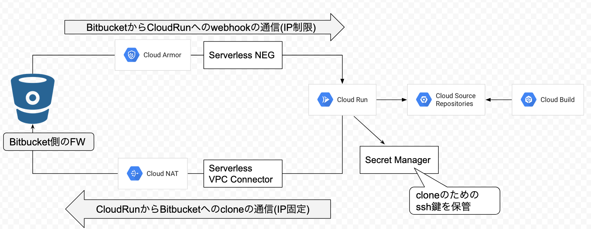

# repeater4gcsr

BitBucketのwebhookを受け取ってGoogle Cloud Source Repositoryへの同期をするServerless実装 + terraform｡

## Motivation
BitBucket Serverにホスティングしたリポジトリを監視してCloudBuildでビルドしたい｡  

しかし､下記のようにGCP側で提供された機能がない｡
* CloudBuildのトリガーはBitBucket Serverに対応していない｡
    * [githubやBitbucket Cloudは可能](https://cloud.google.com/cloud-build/docs/automating-builds/create-manage-triggers?hl=ja#connect_repo)
* Google Cloud Source Repository(gcsr)からBitBucket Serverへの接続は対応していない｡
    * [githubやBitbucket Cloudは可能](https://cloud.google.com/source-repositories/docs/mirroring-a-github-repository?hl=ja)

よって､Bitbucket Serverのwebhookを受け取りgcsrにpushするような中継機能(Repeater)を実装する必要がある｡

ここで､ネットワーク的な制約として以下があるとする｡
* BitBucket Serverは､固定IPのallowlist形式で外部からの接続に制限がかかっている｡
* 外部に公開するエンドポイントにはIP制限をかけることになっている｡

GCEなどのVMに構築すればクリアできるが､VMのメンテナンスコストを払いたくない｡  

そこで､Repeaterは{Cloud Run|Cloud Functions}上にデプロイし､さらに
[Serverless VPC Access](https://cloud.google.com/vpc/docs/configure-serverless-vpc-access) によるIP固定化および､
[Serverlss NEG](https://cloud.google.com/load-balancing/docs/negs/serverless-neg-concepts) とGoogle Cloud Armorによるサービスの保護で､
上記制約をクリアする｡

## Overview



## Install

### init gcloud

```bash
gcloud auth login
gcloud auth application-default login
gcloud config set project your-project-name
```

### Enable apis
```bash
export GCP_PROJECT=your-project-name
APIS=$(cat <<__EOL__
cloudbuild.googleapis.com
compute.googleapis.com
iap.googleapis.com
run.googleapis.com
secretmanager.googleapis.com
vpcaccess.googleapis.com
__EOL__
)
echo ${APIS} | while read API ; do gcloud services enable --project=${GCP_PROJECT} ${API}; done
```

### Add Secrets

```bash
# add Bitbucket key
KEY_NAME=repeater4gcsr-bitbucket-key
ssh-keygen -f /tmp/${KEY_NAME} -N "" -C"ssh key for bitbucket"
gcloud secrets create ${KEY_NAME} --replication-policy="automatic"
gcloud secrets versions add ${KEY_NAME} --data-file /tmp/${KEY_NAME}
cat /tmp/${KEY_NAME}.pub | pbcopy

# add gcsr key
KEY_NAME=repeater4gcsr-gcsr-key
ssh-keygen -f /tmp/${KEY_NAME} -N "" -C"ssh key for gcsr"
gcloud secrets create ${KEY_NAME} --replication-policy="automatic"
gcloud secrets versions add ${KEY_NAME} --data-file /tmp/${KEY_NAME}
cat /tmp/${KEY_NAME}.pub | pbcopy
```

* `/tmp/repeater4gcsr-bitbucket-key.pub` はBitbucketのリポジトリに登録 
* `/tmp/repeater4gcsr-gcsr-key.pub` はSourceRepositoryに登録
    * 登録でログインしていたGCPユーザ名を控える
      * GCSRの認証に個人のSSH鍵を使うことになってるのがイマイチ…｡
      * cloud runで動かせばgcloudの認証を利用できるのか?

### Create tfstate bucket

```bash
gsutil mb -p ${GCP_PROJECT} -l ASIA -b on gs://${GCP_PROJECT}-tfstate
```

### apply

```bash
cd ${ROOT}/terraform
cat > terraform.tfvars << __EOF__
gcp_project   = "${GCP_PROJECT}"
gcp_location  = "asia-northeast1"
gcsr_ssh_user = "yourname@example.com"
__EOF__

terraform init -backend-config="bucket=${GCP_PROJECT}-tfstate"
terraform plan
terraform apply
```

## Deploy CloudFunction Manually

```bash
cd ${ROOT}/app
export GCP_PROJECT=your-project-name
export GCSR_SSH_KEY_USER=yourname@example.com 
make deploy-functions
```

## TODO
- [ ] sync tag add/delete
